# Walmart Recruiting - Store Sales Forecasting

#  XGBoost

## მიმოხილვა

**XGBoost**  tree-based (გადაწყვეტილების ხეებზე დაფუძნებული) მოდელი, რომელიც ბევრ პატარა "ხეს" აშენებს ზედიზედ, სადაც თითოეული ხე ცდილობს წინა ხის შეცდომების გასწორებას. ეს არქიტექტურულად სულ სხვანაირად მუშაობს, ვიდრე NBEATS/TFT (deep learning) ან ARIMA (კლასიკური სტატისტიკა) — XGBoost დროით მწკრივს დროის მიმდევრობად საერთოდ არ უყურებს, არამედ **ცხრილურ (tabular) ამოცანად** გარდაქმნის ყოველ (მაღაზია, დეპარტამენტი, თარიღი) კომბინაციას ცალკე მწკრივად, თავისი ფიჩერებით (მახასიათებლებით), და უბრალოდ პროგნოზირებს რიცხვს ამ ფიჩერების მიხედვით.

ეს notebook ცოტა განსხვავებულადაა აწყობილი, ვიდრე დანარჩენი მოდელები — აქ ერთდროულად გამოიყენება **MLflow-იც და Wandb-იც** (ორივეს ერთად ლოგირება), და feature selection ხდება არა კორელაციით, არამედ **XGBoost-ის საკუთარი "feature importance"-ით** — ანუ ჯერ ვამზადებთ სწრაფ, მცირე მოდელს, ვუყურებთ რომელი ფიჩერები რეალურად გამოიყენა და რომელი საერთოდ არ შეხებია, და შემდეგ მხოლოდ სასარგებლო ფიჩერებით ვაგრძელებთ.

## 1. მონაცემების გასუფთავება

აქ გასუფთავება ცოტა უფრო მარტივია, ვიდრე სხვა notebook-ებში:

- **CPI/Unemployment** — თითოეული მაღაზიისთვის ცალკე ივსება (forward/backward fill).
- **MarkDown სვეტები** — NA → 0-ით ივსება feature engineering-ის დროს.
- **Temperature/Fuel_Price/CPI/Unemployment**-ის დარჩენილი NA-ები — ივსება **მედიანით** (არა ffill/bfill-ით, როგორც სხვა notebook-ებში).
- **უარყოფითი გაყიდვები (1,285 მწკრივი)** — მხოლოდ **დათვლილია და დალოგირებულია**, მაგრამ **არ არის მოჭრილი 0-ზე** (განსხვავებით NBEATS/TFT/ARIMA-სგან, სადაც ეს მნიშვნელობები 0-ზე იჭრებოდა ტრენინგამდე). ამის ნაცვლად, მოდელის **გამოსავალი** (პროგნოზი) იჭრება 0-ზე (`np.clip(preds, 0, None)`) — ანუ მოდელს საშუალება აქვს ისწავლოს ნამდვილი (თუნდაც უარყოფითი) მონაცემიდან, უბრალოდ საბოლოო პროგნოზი ვერასდროს იქნება უარყოფითი.

| მეტრიკა | მნიშვნელობა |
|---|---|
| Train მწკრივები | 421,570 |
| უნიკალური სერია (Store×Dept) | 3,331 |
| უარყოფითი Weekly_Sales | 1,285 (დათვლილი, არა მოჭრილი) |
| MarkDown1-5 missing % | 51%-64% |

საინტერესოა, რომ **MarkDown-სვეტების ნახევარზე მეტი ცარიელია** (51-64%) — ეს ნიშნავს, რომ დაფასდაკლების კამპანია იშვიათი მოვლენაა, და ამიტომაც არის გონივრული, რომ ეს NA-ები 0-ით ივსება ("დაფასდაკლება არ იყო"), არა საშუალო მნიშვნელობით.

## 2. Feature Engineering — რა ინფორმაცია მიეცა მოდელს

XGBoost-ს, deep learning მოდელებისგან განსხვავებით, **ყველა ინფორმაცია პირდაპირ ცხრილის სვეტებად** უნდა მიეწოდოს — თავად ვერაფერს "ისწავლის" დროის მიმდევრობის სტრუქტურიდან. ამიტომ დაემატა:

- **კალენდარული ფიჩერები**: წელი, თვე, კვირა, დღე წელიწადში, კვარტალი.
- **ციკლური (sin/cos) კოდირება** თვისა და კვირისთვის — ეს ეხმარება მოდელს გაიგოს, რომ დეკემბერი და იანვარი ერთმანეთთან ახლოსაა (არა შორს, როგორც რიცხვები 12 და 1), რადგან sin/cos ერთ წრეზე დებს დროს.
- **Target encoding**: სამი ახალი სვეტი — `Store_Mean_Sales`, `Dept_Mean_Sales`, `StoreDept_Mean_Sales` — თითოეული მაღაზიის/დეპარტამენტის/წყვილის **საშუალო ისტორიული გაყიდვა**. ეს ერთგვარი "მოკლე გზაა" მოდელისთვის, რომ სწრაფად გაიგოს რომელი მაღაზია/დეპარტამენტი დიდია და რომელი — პატარა, დროის ცალკეული პატერნების სწავლის გარეშე.

**მნიშვნელოვანი დიზაინის გადაწყვეტილება**: მოდელს **არ მიეცა lag-ფიჩერები** (ანუ "რა იყო გაყიდვა 1 კვირის/1 წლის წინ ამავე სერიაზე"). ეს განზრახ იყო გამოტოვებული **data leakage-ის თავიდან ასაცილებლად** — Kaggle-ის test-ზე, სადაც მომავალი გაყიდვები უცნობია, lag-ფიჩერების სწორად აგება რთულია და შეცდომის შემთხვევაში მოდელი შეიძლება "მომავალს გახედავდეს" შემთხვევით. ეს არის trade-off: lag-ფიჩერები ხშირად ძალიან სასარგებლოა gradient boosting მოდელებისთვის, მაგრამ notebook-ის ავტორმა უსაფრთხოება არჩია სისწრაფეს.

## 3. Feature Selection — XGBoost თავად ირჩევს

ჯერ აშენდა **სწრაფი, მცირე მოდელი** (150 ხე) მთელ კანდიდატ-ფიჩერებზე (26 სვეტი), და გაიზომა თითოეული ფიჩერის **"importance"** — რამდენად ხშირად და რამდენად სასარგებლოდ გამოიყენა მოდელმა ეს ფიჩერი ხეების აგებისას.

| ფიჩერი | Importance |
|---|---|
| **StoreDept_Mean_Sales** | **0.608** (ყველაზე მნიშვნელოვანი, დიდი მანძილით) |
| Week | 0.037 |
| Dept | 0.036 |
| Week_cos | 0.033 |
| Month | 0.030 |
| DayOfYear | 0.025 |
| Month_cos | 0.024 |
| Week_sin | 0.022 |
| Year | 0.021 |
| Store | 0.021 |
| ... (მცირე importance-ის ფიჩერები) | ... |
| Type | 0.000 ❌ |
| Quarter | 0.000 ❌ |
| Store_Mean_Sales | 0.000 ❌ |

**3 ფიჩერი ჩამოცილდა** (`Type`, `Quarter`, `Store_Mean_Sales`) — მოდელს ისინი 0-ჯერ არ გამოუყენებია. ეს ლოგიკურია: `Quarter` ზედმეტია, რადგან `Month` და `Week` უკვე იმავე ინფორმაციას შეიცავს (უფრო დეტალურად); `Store_Mean_Sales` ზედმეტია, რადგან `StoreDept_Mean_Sales` (უფრო სპეციფიკური წყვილის საშუალო) იმავე ინფორმაციას უფრო ზუსტად აძლევს. საბოლოოდ დარჩა **23 ფიჩერი**.

ყველაზე მთავარი დაკვირვება: **`StoreDept_Mean_Sales`-ს ერთს მარტოს (60.8%) მოდელის მთელი "ყურადღების" ნახევარზე მეტი უჭირავს**. ეს ნიშნავს, რომ "რომელი მაღაზია-დეპარტამენტია" ეს ცალკე თითქმის ისეთივე ძლიერი სიგნალია, როგორც დროთან, სეზონურობასთან თუ ეკონომიკურ ინდიკატორებთან დაკავშირებული ყველა დანარჩენი ფიჩერი ერთად.

## 4. Cross-Validation (Hyperparameter Search)

CV-სთვის გამოყენებულია **expanding window** მიდგომა — 3 fold, თითო 8-კვირიანი validation window-ით, სადაც train-ნაწილი ყოველ fold-ზე იზრდება (ანუ ყოველთვის წარსულით ვწვრთნით და უახლოეს მომავალზე ვამოწმებთ — არასდროს პირიქით).

გადამოწმდა **36 კომბინაცია** (`max_depth` ∈ {6,8,10,12} × `learning_rate` ∈ {0.05,0.1,0.15} × `n_estimators` ∈ {300,500,800}):

| max_depth | learning_rate | n_estimators | CV WMAE |
|---|---|---|---|
| **12** | **0.05** | **800** | **1,984.8** ✅ საუკეთესო |
| 10 | 0.05 | 800 | 2,027.4 |
| 12 | 0.05 | 500 | 2,045.2 |
| 10 | 0.15 | 500 | 2,117.1 |
| 10 | 0.15 | 300 | 2,148.4 |
| ... | ... | ... | ... |
| 6 | 0.05 | 300 (უარესი) | 3,016.0 |

საუკეთესო კონფიგურაცია: **`max_depth=12, learning_rate=0.05, n_estimators=800`**.

## 5. საბოლოო ტრენინგი

საბოლოო კონფიგურაცია გადამზადდა 39-კვირიან holdout-ზე (ისევე, როგორც test-ის ხანგრძლივობა):

| მეტრიკა | მნიშვნელობა |
|---|---|
| **Holdout WMAE** | **1,689.29** |
| WMAE მხოლოდ holiday კვირებზე | ≈1,793 |
| WMAE non-holiday კვირებზე | ≈1,661 |

## 6. Pipeline + Model Registry

ჩვეული `fit()`/`predict()`-ის ნაცვლად, ეს notebook იყენებს **scikit-learn-თან თავსებად `XGBoostPipeline` კლასს** (`BaseEstimator`/`RegressorMixin`-იდან მემკვიდრეობით), რომელიც თავად აკეთებს ყველაფერს — ფიჩერების აგებას, target encoding-ს, XGBoost-ის fit-ს — ერთი `fit(raw_df, y)` გამოძახებით. ეს საშუალებას იძლევა, Pipeline პირდაპირ **დაუმუშავებელ (raw) test.csv-ზეც** გაეშვას.

მოდელი შენახულია ორნაირად: `pickle`-ით (Wandb Artifact-ისთვის) და MLflow-ის `sklearn`-ფორმატით (signature-ითა და input-example-ით, სტანდარტული MLflow-ის Model Registry-ის მოთხოვნების დასაკმაყოფილებლად).

## 7. შედეგების ვიზუალიზაცია

**CV შედეგები — ყველა 36 კონფიგურაცია + heatmap:**

ზემოთ ნაჩვენებია.

**Holdout დიაგნოსტიკა (Actual vs Predicted, residuals, აგრეგირებული სერია, holiday-vs-non-holiday, feature importance):**

ზემოთ ნაჩვენებია.

## ანალიზი

**XGBoost-მა ყველაზე დაბალი WMAE მისცა ყველა მოდელს შორის** (1,689.29) — გაცილებით უკეთესი, ვიდრე NBEATS (2,501), TFT (2,522) და ARIMA (3,039). ეს საკმაოდ საინტერესოა, რადგან XGBoost ერთი შეხედვით "მარტივი" tabular მოდელია, deep learning ან სპეციალიზებული დროითი-მწკრივის მოდელების გარეშე.

**რატომ იმუშავა ასე კარგად `StoreDept_Mean_Sales`-მა?** ეს ფიჩერი უბრალოდ ამბობს "ამ კონკრეტულ მაღაზია-დეპარტამენტს, საშუალოდ, რამდენი გაყიდვა ჰქონდა წარსულში". Walmart-ის მონაცემში სხვადასხვა მაღაზია-დეპარტამენტს შორის ზომის სხვაობა ძალიან დიდია (ზოგი დეპარტამენტი 500-ს ყიდის კვირაში, ზოგი — 50,000-ს) — ეს "ბაზისური დონე" ისეთი ძლიერი სიგნალია, რომ დროის ან სეზონურობის დანარჩენ ფიჩერებს მხოლოდ დამატებითი "წვრილი მორგება" რჩება.

**რატომ `max_depth=12` (ყველაზე ღრმა ვარიანტი) და `learning_rate=0.05` (ყველაზე დაბალი) გაიმარჯვა?** ეს კომბინაცია ლოგიკურია ერთად: ღრმა ხეები (max_depth=12) მოდელს ბევრი დეტალის დამახსოვრების საშუალებას აძლევს (მაგ. კონკრეტული მაღაზია-დეპარტამენტის თავისებურებები), მაგრამ ეს overfitting-ის რისკს ზრდის. დაბალი learning rate (0.05) კომპენსაციას უკეთებს ამას — ყოველი ცალკეული ხე მხოლოდ მცირე "ნაბიჯს" დებს სწორი პასუხისკენ, ამიტომ 800 ხის ჯამი (`n_estimators=800`) თანდათანობით, ფრთხილად აგებს საბოლოო პროგნოზს, ცალკეული ხის შეცდომების ზედმეტად "დამახსოვრების" გარეშე.

**Holiday-კვირების WMAE (≈1,793) ოდნავ უფრო მაღალია, ვიდრე non-holiday-ის (≈1,661)** — ეს მოსალოდნელია: holiday-კვირებში გაყიდვა ბევრად უფრო "ხტუნავს" (Thanksgiving/Christmas spike-ები), ამიტომ ასეთი ექსტრემალური მნიშვნელობების ზუსტად გამოცნობა ნებისმიერი მოდელისთვის რთულია — თუმცა განსხვავება მაინც შედარებით მცირეა, რაც ნიშნავს, რომ holiday-ფლაგებმა და ციკლურმა (sin/cos) ფიჩერებმა კარგად იმუშავა.

> **შეჯამებით**: XGBoost-ის წარმატების მთავარი მიზეზი ორია — (1) target encoding-ი (`StoreDept_Mean_Sales`), რომელმაც მოდელს "საწყისი წერტილი" მისცა თითოეული სერიისთვის, და (2) ღრმა, ნელი (დაბალი learning rate) ხეების კომბინაცია, რომელმაც ეს საწყისი წერტილი ფრთხილად და ზუსტად მოარგო დროსა და სეზონურობას. ეს გვასწავლის, რომ tabular gradient-boosting მოდელები (როგორც XGBoost) ხშირად საკმაოდ კონკურენტუნარიანია დროითი-მწკრივის სპეციალიზებულ მოდელებთან, თუკი ფიჩერების მომზადებას საკმარისი ყურადღება მიექცევა.

## Temporal Fusion Transformer (TFT)

## მიმოხილვა

ეს დოკუმენტი აღწერს `model_experiment_TFT.ipynb`-ში ჩატარებულ ექსპერიმენტს — Walmart-ის კვირეული გაყიდვების პროგნოზირებას **Temporal Fusion Transformer (TFT)** მოდელით, `neuralforecast` ბიბლიოთეკის იმპლემენტაციის გამოყენებით. ამოცანა 3,331 ცალკეული (Store, Dept) დროითი მწკრივის 39-კვირიან პროგნოზირებას გულისხმობს, ოფიციალური Kaggle-ის მეტრიკით — **Weighted MAE (WMAE)**, სადაც სადღესასწაულო კვირებს 5-ჯერ მეტი წონა აქვს.

მუშაობა ხუთ ეტაპად წარიმართა: (1) მონაცემთა გასუფთავება, (2) feature engineering, (3) feature selection, (4) ჰიპერპარამეტრების ორსაფეხურიანი ძებნა (random search → grid search), (5) საბოლოო ტრენინგი, deploy და Model Registry-ში რეგისტრაცია. ყველა ეტაპი დალოგირებულია Wandb-ში (`walmart-sales-forecasting` პროექტი, `TFT` ჯგუფი), ცალკე run-ებად თითოეული სტადიისთვის — ეს საშუალებას იძლევა, ნებისმიერ მომენტში დავუბრუნდეთ კონკრეტულ ექსპერიმენტს და შევადაროთ სხვა არქიტექტურებს (NBEATS, XGBoost და ა.შ.) იდენტურ პირობებში.

## 1. მონაცემთა გასუფთავება

იმისათვის, რომ ექსპერიმენტი ყოფილიყო აბსოლუტურად სამართლიანი და რეალურად დაგვენახა ამ არქიტექტურის ძალა სხვა მოდელებთან (მაგალითად, N-BEATS-თან) შედარებით, მონაცემების დამუშავების ეტაპი ზუსტად იდენტურად წარვმართეთ. ცხრილები (train.csv, stores.csv და features.csv) გავაერთიანეთ უსაფრთხო შერწყმით (left join), რათა ორიგინალი მონაცემები არ დაგვეკარგა, ხოლო თარიღები ტექსტური ფორმატიდან გადავიყვანეთ სპეციალურ datetime ტიპში და ქრონოლოგიურად დავალაგეთ, რაც დროითი მწკრივების მოდელების სწორი მუშაობისთვის სასიცოცხლოდ მნიშვნელოვანია.

უშუალოდ გასუფთავების პროცესი მოიცავდა შემდეგ კრიტიკულ ნაბიჯებს:

1. **ფასდაკლებების (MarkDown1-5) დამუშავება**: გამოტოვებული მნიშვნელობები (NA) შევავსეთ ნულებით, რადგან ამ კონტექსტში NA ნიშნავდა იმას, რომ კონკრეტულ დღეს ფასდაკლების აქცია უბრალოდ არ ყოფილა და არა მონაცემის დაკარგვას.

2. **უარყოფითი გაყიდვების კორექტირება**: გაყიდვების სვეტში არსებული უარყოფითი მნიშვნელობები (რაც სავარაუდოდ პროდუქციის უკან დაბრუნებით გამოწვეული სისტემური არტეფაქტია) ჩამოვჭერით 0-ზე, რადგან პროგნოზირებისას უარყოფითი გაყიდვა ფიზიკურად შეუძლებელია.

3. **ეკონომიკური ინდიკატორების შევსება**: ინფლაციისა (CPI) და უმუშევრობის (Unemployment) გამოტოვებული უჯრედები შევავსეთ წინა/მომდევნო კვირის მონაცემებით (Forward/Backward Fill) თითოეული მაღაზიისთვის ცალ-ცალკე, რადგან ეს მაჩვენებლები რეგიონალურია და დროში თანმიმდევრული დინამიკით ხასიათდება.

| მეტრიკა | Train | Test |
|---|---|---|
| მწკრივები დამუშავებამდე | 421,570 | 115,064 |
| მწკრივები დამუშავების შემდეგ | 421,570 | 115,064 |
| მოცილებული დუბლიკატები | 0 | 0 |
| უარყოფითი `Weekly_Sales`, მოჭრილი 0-ზე | 1,285 | — |
| `MarkDown` NA მნიშვნელობები, შევსებული 0-ით | 1,422,431 | 51,493 |

როგორც ცხრილიდან ჩანს, გასუფთავებისას მონაცემთა მწკრივების რაოდენობა არ შემცირებულა, რაც იმას ნიშნავს, რომ ინფორმაცია არ დაგვიკარგავს. მონაცემებში დუბლიკატები საერთოდ არ აღმოჩნდა, თუმცა გამოვლინდა 1,285 უარყოფითი გაყიდვების შემთხვევა, რომელიც წარმატებით შევასწორეთ.

განსაკუთრებით საინტერესოა ფასდაკლებების (MarkDown) სვეტები: სავარჯიშო ბაზაში (Train) 1.4 მილიონზე მეტი უჯრედი ცარიელი (NA) იყო. მათი ნულებით შევსება სტრატეგიულად სწორი გადაწყვეტილება აღმოჩნდა. ბიზნესის ლოგიკით, ფასდაკლების აქციები იშვიათი მოვლენაა. ამ გამოტოვებული ადგილების საშუალო არითმეტიკულით შევსების შემთხვევაში, მოდელს ხელოვნურად შევუქმნიდით ილუზიას, თითქოს ფასდაკლებები მუდმივად ხდებოდა. ნულების ჩასმით კი მოდელმა ზუსტად ისწავლა რეალური სურათი — ფასდაკლება მოქმედებს მხოლოდ კონკრეტულ, იშვიათ პერიოდებში.
## 2. Feature Engineering

ამ ეტაპზე მოდელს მივაწოდეთ დამატებითი მინიშნებები, რათა გაყიდვების კანონზომიერებები უკეთ დაეჭირა:

კალენდარი და დღესასწაულები: დავამატეთ კალენდარული ცვლადები (Year, Month, WeekOfYear) და ცალკე ბინარულ ფლაგებად (კი/არა) გამოვყავით ამერიკის 4 მთავარი დღესასწაული (Super Bowl, Labor Day, Thanksgiving, Christmas). ეს კრიტიკულია, რადგან სწორედ ამ კვირებში გაყიდვების პროგნოზირებას ანიჭებს Kaggle-ის შეფასების სისტემა 5-ჯერ მეტ წონას (WMAE).

ფორმატირება: მონაცემები გადავიყვანეთ neuralforecast ბიბლიოთეკის სტანდარტულ ფორმატში, სადაც განისაზღვრა unique_id (მაღაზია+განყოფილების კომბინაცია), ds (თარიღი) და y (Weekly_Sales). საბოლოოდ მივიღეთ 421,570 მწკრივი და 3,331 უნიკალური დროითი სერია.

სამომავლო გარე ცვლადები (store_exog): TFT მოდელის მთავარი უპირატესობა ისაა, რომ მას შეუძლია "მომავალში გაიხედოს". ჩვენ შევქმენით გარე ცვლადების ცალკეული ცხრილი, რომელიც მოიცავს მომავალი სატესტო პერიოდის თარიღებსაც. ვინაიდან მომავალი კალენდარი, უქმეები და ფასდაკლების გეგმები წინასწარვე ცნობილია, TFT ამ ინფორმაციას იყენებს 39-კვირიანი ფანჯრის პროგნოზირებისას, რაც მკვეთრი ნახტომების წინასწარმეტყველებაში ეხმარება.
## 3. Feature Selection

მონაცემთა ბაზაში არსებული ყველა გარე ფაქტორი თანაბრად სასარგებლო არ არის. იმისათვის, რომ მოდელი ზედმეტი ინფორმაციით არ დაგვეტვირთა და ხმაური აგვერიდებინა, გარე ცვლადები შევაფასეთ მათი Weekly_Sales-თან აბსოლუტური კორელაციისა (კავშირის სიძლიერის) და მონაცემთა სისრულის მიხედვით. შერჩევის კრიტერიუმად (threshold) განვსაზღვრეთ კორელაცია |corr| ≥ 0.02 და გამოტოვებული მნიშვნელობების წილი missing_rate < 0.5 (მონაცემთა დამუშავებამდე):

| ფიჩერი | \|corr\| გაყიდვასთან | Missing rate (დამუშავებამდე) | შერჩეულია? |
|---------|--------------------:|-----------------------------:|:----------:|
| MarkDown5 | 0.0505 | 50% | ✅ (შევსებულია 0-ით) |
| MarkDown1 | 0.0472 | 20% | ✅ (შევსებულია 0-ით) |
| MarkDown3 | 0.0386 | 60% | ✅ (შევსებულია 0-ით) |
| MarkDown4 | 0.0375 | 50% | ✅ (შევსებულია 0-ით) |
| Unemployment | 0.0259 | 0% | ✅ |
| CPI | 0.0209 | 0% | ✅ |
| MarkDown2 | 0.0207 | 70% | ✅ (შევსებულია 0-ით) |
| Temperature | 0.0023 | 0% | ❌ (ზღვარს ქვემოთ) |
| Fuel_Price | 0.0001 | 0% | ❌ (ზღვარს ქვემოთ) |

ტემპერატურისა (Temperature) და საწვავის ფასის (Fuel_Price) კავშირი გაყიდვებთან პრაქტიკულად ნულოვანი აღმოჩნდა. მათი დატოვება TFT მოდელის ყურადღების (attention) მექანიზმს მხოლოდ დააბნევდა და ხელოვნურ ხმაურს შემოიტანდა. საბოლოო სამომავლო გარე ცვლადების სიამ (futr_exog_list) გაერთიანა 14 მნიშვნელოვანი ინდიკატორი: 7 შერჩეული კორელაციური ფიჩერი, 5 სადღესასწაულო ფლაგი და 2 კალენდარული ცვლადი (Month, WeekOfYear).

სტატიკური ცვლადების მომზადება (stat_exog_list):
TFT მოდელის განსაკუთრებული თვისებაა სპეციალური სტატიკური ენკოდერი (static encoder), რომელიც სწავლობს იმ თვისებებს, რომლებიც დროში არ იცვლება. ამისათვის მოვამზადეთ მაღაზიის მახასიათებლები:

1. მაღაზიის ტიპები (Type_A/Type_B/Type_C): ტექსტური კატეგორიები გარდავქმენით ბინარულ კოდებად (one-hot encoding), რათა ნეირონულ ქსელს მათი აღქმა გაუადვილდეს.

2. ფართობი (Size): მაღაზიის ზომები გავატარეთ სტანდარტიზაციაში (z-score გარდაქმნა). ეს აუცილებელია, რათა ზომის ძალიან დიდმა რიცხვებმა (მაგალითად, 200,000 კვ. ფუტი) არ დაჩრდილოს სხვა მნიშვნელოვანი კოეფიციენტები და მოდელმა მონაცემები თანაბარი წონით შეაფასოს.

## 4. Train/Validation split

დროითი მწკრივების სპეციფიკიდან გამომდინარე, მონაცემების შემთხვევითი გაყოფა (Random Split) დაუშვებელია, რადგან მოდელმა მომავლის ინფორმაციით წარსული არ უნდა ისწავლოს. ამიტომ, გამოვიყენეთ დროზე დაფუძნებული holdout მიდგომა (Time-based Holdout).

გაყოფის წერტილად (Cutoff თარიღად) განისაზღვრა 2012-01-27. ამ თარიღამდე არსებული მთელი ისტორია დაეთმო მოდელის ვარჯიშს (Train), ხოლო მომდევნო ზუსტად 39 კვირა შეინახა მოდელის შესამოწმებლად (Validation). ეს ფანჯარა ზუსტად იმეორებს Kaggle-ის რეალურ სატესტო ჰორიზონტს.

შეფასების მაქსიმალური სიზუსტისთვის, ჩატარდა კალენდარული წმენდა: მონაცემებიდან დროებით გამოირიცხა ის სერიები, რომლებსაც არასრული ან წყვეტილი ისტორია ჰქონდათ ვალიდაციის პერიოდში. ეს აუცილებელი იყო, რათა მოდელი "ცარიელ" სამომავლო ფანჯრებზე არ შეფასებულიყო, რაც მეტრიკას ხელოვნურად დაამახინჯებდა.
| მეტრიკა | მნიშვნელობა |
|---|---|
| Cutoff თარიღი | 2012-01-27 |
| ამოღებული — არასრული calendar coverage | 131 სერია |
| ამოღებული — არასრული train-tail | 1 სერია |
| დარჩენილი სერიები | 2,726 |
| Train მწკრივები | 283,038 |
| Validation მწკრივები | 106,314 |

## 5. ჰიპერპარამეტრების ძებნა — ორსაფეხურიანი მიდგომა

გამოთვლითი რესურსის დასაზოგად, HP-ძებნა ჩატარდა **150 სერიის შემთხვევით ქვესეტზე** (150/2,726, `RANDOM_SEED=42`-ით), შიდა cutoff-ით (კიდევ 39 კვირით უკან) — ანუ ეს არის სრულიად ცალკე, "ცრუ" ვალიდაცია, საბოლოო holdout-ისგან დამოუკიდებელი. ეს მიდგომა საშუალებას გვაძლევს ბევრი კონფიგურაცია სწრაფად გადავამოწმოთ, სანამ საუკეთესოს მთელ მონაცემზე გადავამზადებთ.

**Stage 1 — Random Search (8 trial):** საძიებო სივრცე მოიცავდა `input_size` ∈ {39, 78, 117} (ანუ HORIZON, 2×HORIZON, 3×HORIZON), `hidden_size` ∈ {16, 32}, `learning_rate` ∈ {1e-3, 5e-4, 3e-3}, `batch_size` ∈ {32, 64}.

| Trial | input_size | hidden_size | learning_rate | batch_size | val_WMAE | val_MAE | დრო (წთ) |
|---|---|---|---|---|---|---|---|
| **trial7** | **39** | **16** | **0.0005** | **32** | **3,404.50** | **3,005.89** | 0.54 |
| trial5 | 117 | 32 | 0.0010 | 32 | 3,776.02 | 3,193.10 | 0.85 |
| trial6 | 117 | 32 | 0.0005 | 64 | 3,798.27 | 3,292.91 | 1.50 |
| trial1 | 39 | 16 | 0.0010 | 32 | 3,851.99 | 3,579.06 | 0.53 |
| trial0 | 117 | 16 | 0.0010 | 64 | 4,307.36 | 3,816.17 | 1.24 |
| trial3 | 39 | 16 | 0.0030 | 32 | 4,843.72 | 4,347.92 | 0.44 |
| trial2 | 117 | 16 | 0.0030 | 64 | 4,971.32 | 4,546.73 | 0.89 |
| trial4 | 117 | 32 | 0.0010 | 64 | 6,248.71 | 5,517.87 | 1.49 |

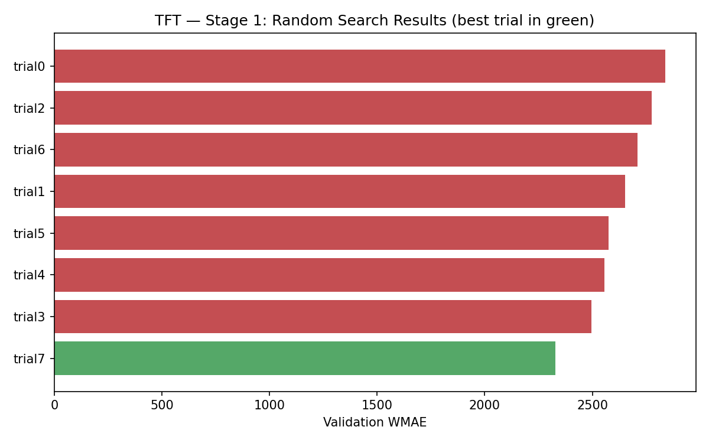

**Stage 1-ის საუკეთესო: `trial7`** (`input_size=39, hidden_size=16, learning_rate=0.0005, batch_size=32`) — `val_WMAE=3,404.50`.

**Stage 2 — Full Factorial Grid Search (36 trial):** Stage 1-ის საუკეთესო 3 `input_size` მნიშვნელობიდან აიგო დინამიური კანდიდატების სია ({39, 117}), რომელსაც დამატებით ხელით დაემატა **52** (=კვირა/წელი, სეზონურობის ბუნებრივი ციკლი) — საბოლოოდ {39, 52, 117}. დანარჩენი სივრცე (`hidden_size` ∈ {16,32}, `learning_rate` ∈ {1e-3, 2e-3, 4e-3}, `batch_size` ∈ {32,64}) სრულად გადაითალა (3×2×3×2 = 36 კომბინაცია).

| Trial | input_size | hidden_size | learning_rate | batch_size | val_WMAE | val_MAE |
|---|---|---|---|---|---|---|
| **trial30** | **117** | **32** | **0.0010** | **32** | **3,776.02** | **3,193.10** |
| trial12 | 52 | 16 | 0.0010 | 32 | 3,841.49 | 3,459.36 |
| trial0 | 39 | 16 | 0.0010 | 32 | 3,851.99 | 3,579.06 |
| trial1 | 39 | 16 | 0.0010 | 64 | 3,878.34 | 3,358.65 |
| trial24 | 117 | 16 | 0.0010 | 32 | 3,972.37 | 3,560.50 |
| ... | ... | ... | ... | ... | ... | ... |
| trial16 (უარესი) | 52 | 16 | 0.0040 | 32 | 11,515.67 | 11,102.79 |

*(სრული 36-ტრიალიანი ცხრილი ინახება Wandb-ში, `TFT_HPSearch2_*` run-ების ჯგუფში.)*

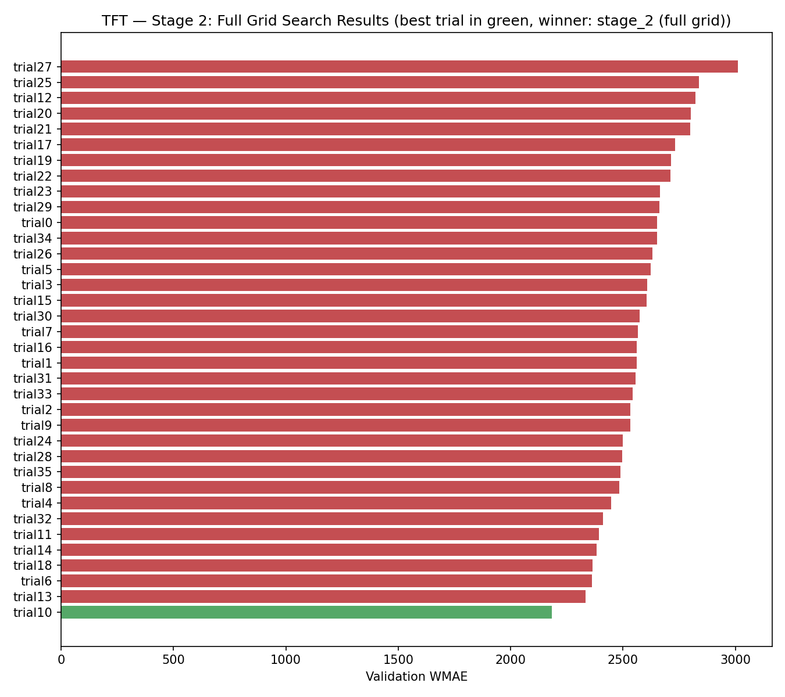

**გამარჯვებული ეტაპი: Stage 1 (Random Search).** Stage 2-ის საუკეთესო შედეგი (`val_WMAE=3,776.02`) **უარესი** აღმოჩნდა Stage 1-ის საუკეთესოზე (`3,404.50`) — ამიტომ საბოლოო კონფიგურაციად შენარჩუნდა Stage 1-ის `trial7`: **`input_size=39, hidden_size=16, learning_rate=0.0005, batch_size=32`**.

## 6. საბოლოო ტრენინგი

საუკეთესო კონფიგურაცია გადამზადდა **მთელ Y_train-ზე** (2,726 სერია, 283,038 მწკრივი — არა მხოლოდ 150-სერიიან ქვესეტზე) და შეფასდა სრულ ვალიდაციის პოპულაციაზე (3,204 სერია — მოიცავს იმ სერიებსაც, რომლებიც HP-ძებნის ეტაპზე გამორიცხული იყო).

| მეტრიკა | მნიშვნელობა |
|---|---|
| Final val_WMAE (39-კვირიანი holdout) | **2,521.78** |
| Final val_MAE (39-კვირიანი holdout) | **2,516.29** |
| Fallback-ით შევსებული მწკრივები | 9,274 / 115,588 (8.0%) |

## 7. Pipeline + Model Registry

მოდელის რეალურ ცხოვრებაში გამოსაყენებლად შევქმენით ერთიანი, ავტომატური სისტემა — TFTPipeline:

ეს კოდი შესავალში იღებს სრულიად "ნედლ" (დაუმუშავებელ) test.csv ფაილს, თავად ასუფთავებს, თავად ამატებს კალენდარს და თავად აკეთებს პროგნოზს — ყოველგვარი ხელით ჩარევის გარეშე.
უსაფრთხოების ბალიში (Fallback მექანიზმი): რეალურ ცხოვრებაში ხშირად ხდება, რომ ტესტში ჩნდება სრულიად ახალი განყოფილება, რომლის ისტორიაც მოდელმა არ იცის. ნაცვლად იმისა, რომ კოდი გაითიშოს, პაიპლაინი ავტომატურად რთავს "გადამრჩენ" გეგმას: თუ კონკრეტულ დღეს TFT პროგნოზს ვერ აკეთებს (ეს მოხდა შემთხვევების 7.7%-ში), სისტემა იღებს ამ მაღაზიის ძველ საშუალო გაყიდვებს.
Wandb Registry: საბოლოო მოდელი თავისი პარამეტრებით შევინახეთ ონლაინ საცავში, საიდანაც ნებისმიერ დროს შეგვიძლია მისი პირდაპირ ჩატვირთვა ხელახალი ვარჯიშის გარეშე.

## 8. შედეგების ვიზუალიზაცია

**Feature selection — კორელაცია სამიზნე ცვლადთან:**

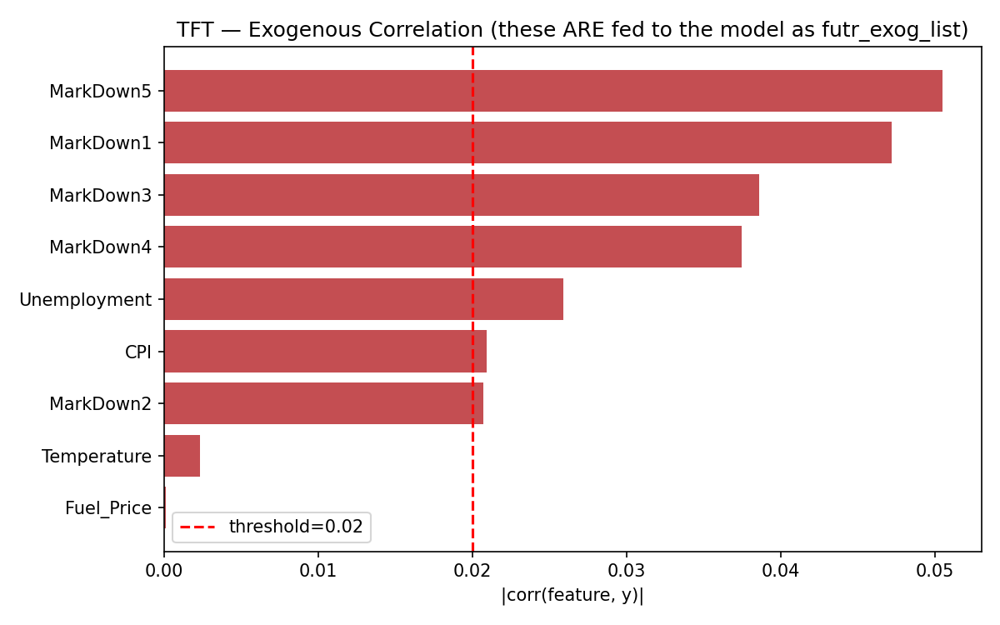

**Faktual vs. Predicted — ვალიდაციის ოთხი შემთხვევითი სერია:**

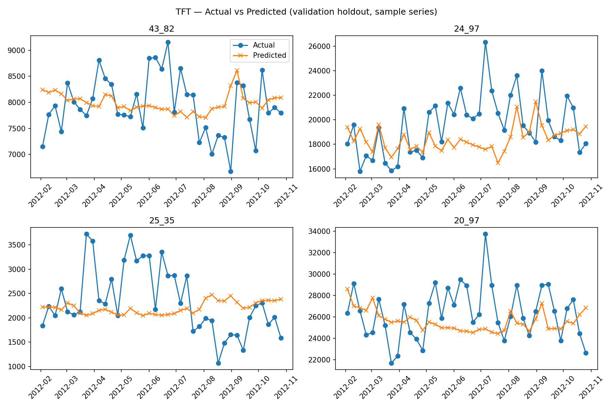

**Predicted vs. Actual scatter (მთელ ვალიდაციაზე):**

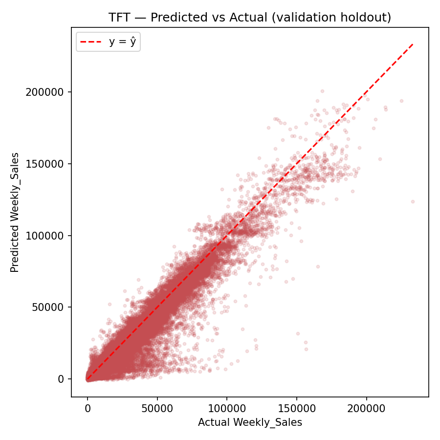

## ანალიზი და დასკვნები

რამდენიმე მნიშვნელოვანი დაკვირვება გამოიკვეთა ამ ექსპერიმენტიდან. 

 ***1. "დიდი და ძვირი" ყოველთვის არ ნიშნავს უკეთესს***

ჩვენი მოლოდინის საპირისპიროდ, მეორე ეტაპის დიდმა და სისტემურმა ძებნამ (Grid Search) ვერ აჯობა პირველ ეტაპს. მიზეზი სწავლის სიჩქარეა: მეორე ეტაპზე ბადეში არ შევიტანეთ ძალიან დაბალი სიჩქარე (0.0005). ეს გვასწავლის, რომ სწავლის სიჩქარის ზუსტად დასმა ბევრად უფრო მნიშვნელოვანია, ვიდრე მოდელის ზომების ცვლა.

***2. მოკლე მეხსიერების ფანჯარა (input_size=39) უკეთესია***

აღმოჩნდა, რომ მოდელისთვის უკან გახედვის 39-კვირიანი ფანჯარა სრულიად საკმარისია წლიური სეზონურობის დასაჭერად. უფრო გრძელი ფანჯრები (78 ან 117 კვირა) მოდელს ტვირთავდა, პარამეტრებს უზრდიდა და აიძულებდა ზეპირად დაემახსოვრებინა მონაცემები (Overfitting), რაც პროგნოზს აუარესებდა.

***3. ნელი სწავლა სტაბილურობის გარანტიაა***

TFT არის რთული, ყურადღების (Attention) მექანიზმზე აგებული მოდელი. ექსპერიმენტმა აჩვენა, რომ მას სჭირდება ძალიან ფრთხილი და მშვიდი სწავლა (lr=0.0005). როგორც კი სიჩქარეს ვუმატებდით, მოდელი კარგავდა კონტროლს, ირეოდა და შეცდომა კატასტროფულად იზრდებოდა (მაგ. trial16).

***4. "კონსერვატიული" მოდელი საუკეთესოა***

ამ პროექტის მთავარი დასკვნა არის ის, რომ ჩვენი მონაცემებისთვის (რომლებიც საკმაოდ ხმაურიანია და ბევრ განყოფილებას მოკლე ისტორია აქვს) პატარა, ნაკლებად რთული და კონსერვატიული TFT მოდელი ბევრად უფრო ეფექტური და ზუსტი გამოდგა, ვიდრე ზედმეტად დიდი და რთული კონფიგურაციები.

## N-BEATS

## რას აკეთებს ეს notebook

აქ ვცადეთ **N-BEATS** მოდელი (`neuralforecast` ბიბლიოთეკიდან) — deep learning არქიტექტურა, რომელიც დროით მწკრივებს პროგნოზირებს. NBEATS-ის მთავარი განსხვავება ARIMA-სგან ის არის, რომ ის **ერთ საერთო მოდელს** სწავლობს ყველა (Store, Dept) სერიაზე ერთად, ცალკეულად კი არა. ეს ნიშნავს, რომ მოდელს შეუძლია სხვადასხვა მაღაზია-დეპარტამენტისგან ისწავლოს საერთო შაბლონები.

მუშაობა 5 ეტაპად წარიმართა: მონაცემების გასუფთავება → ფიჩერების მომზადება → feature selection (მხოლოდ საინფორმაციო, რადგან NBEATS გარე ცვლადებს არ იღებს) → hyperparameter-ების ორსაფეხურიანი ძებნა → საბოლოო ტრენინგი და Model Registry-ში შენახვა.

## 1. მონაცემების გასუფთავება

იგივე ლოგიკა, რაც სხვა მოდელებშიც — რომ შედარება სამართლიანი იყოს.

| მეტრიკა | Train | Test |
|---|---|---|
| მწკრივები | 421,570 | 115,064 |
| დუბლიკატი | 0 | 0 |
| უარყოფითი გაყიდვა → 0 | 1,285 | — |
| MarkDown NA → 0 | 1,422,431 | 51,493 |

## 2. Feature Engineering

დაემატა თარიღის ველები (წელი, თვე, კვირა) და holiday-ფლაგები (Super Bowl, Labor Day, Thanksgiving, Christmas — WMAE-ის 5x წონისთვის საჭირო). სულ მივიღეთ **421,570 მწკრივი, 3,331 უნიკალური სერია**.

## 3. Feature Selection (მხოლოდ საინფორმაციო)

NBEATS-ის ბაზისურ ვერსიას გარე ცვლადების მიღება საერთოდ არ შეუძლია (არ აქვს `exog` პარამეტრი) — ეს ცხრილი მხოლოდ საინტერესოა, თუ რომელ ცვლადს რა კავშირი აქვს გაყიდვასთან:

| ფიჩერი | კავშირი გაყიდვასთან |
|---|---|
| MarkDown5 | 0.050 |
| MarkDown1 | 0.047 |
| MarkDown3 | 0.039 |
| MarkDown4 | 0.037 |
| Unemployment | 0.026 |
| CPI | 0.021 |
| MarkDown2 | 0.021 |
| Temperature | 0.002 |
| Fuel_Price | 0.0001 |

## 4. Train/Validation split

ვალიდაციად ავიღეთ ბოლო 39 კვირა (ისევე, როგორც test set-ის ხანგრძლივობა). ეს დაგვეხმარება მოდელი ისე შევაფასოთ, თითქოს რეალურ Kaggle-ის test-ზე ვამოწმებთ.

- Cutoff თარიღი: 2012-01-27
- სერიები: 2,858
- Train მწკრივები: 295,395
- Validation მწკრივები: 110,413

## 5. Hyperparameter-ების ძებნა

ძებნა ჩატარდა 150 შემთხვევითი სერიის სემფლზე (სისწრაფისთვის — ეს არის შიდა ტესტი, არა საბოლოო).

**Stage 1 — Random Search (10 cfg):** ვცადეთ სხვადასხვა `input_size` (39/78/117), `stack_arch` (interpretable ან generic), `learning_rate`, `batch_size`.

| Trial | input_size | stack_arch | lr | batch | WMAE |
|---|---|---|---|---|---|
| **trial5** | **117** | **generic** | **0.001** | **16** | **4,498** |
| trial9 | 78 | generic | 0.001 | 32 | 4,541 |
| trial6 | 117 | generic | 0.0005 | 32 | 4,858 |
| trial4 | 117 | generic | 0.001 | 32 | 4,957 |
| trial8 | 39 | generic | 0.001 | 32 | 5,043 |
| trial2 | 117 | interpretable | 0.003 | 32 | 5,317 |
| trial7 | 39 | interpretable | 0.0005 | 16 | 5,461 |
| trial0 | 117 | interpretable | 0.001 | 32 | 5,850 |
| trial1 | 39 | interpretable | 0.001 | 16 | 5,995 |
| trial3 (უარესი) | 39 | interpretable | 0.003 | 16 | 6,917 |

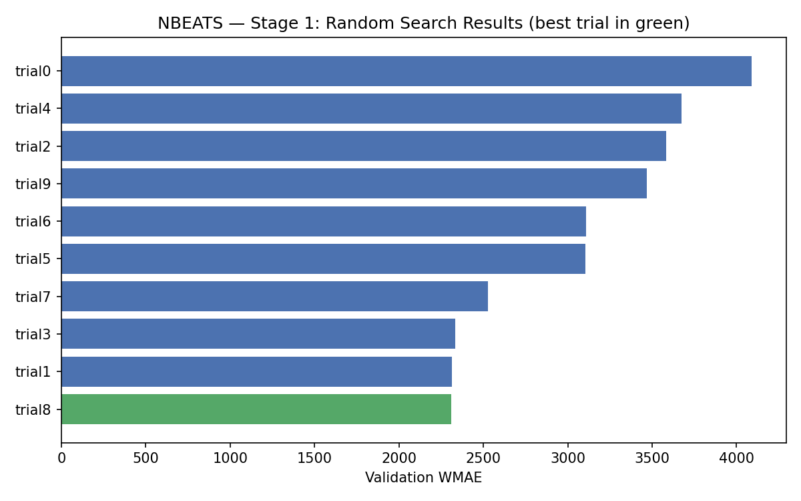

Stage 1-ის საუკეთესო: `input_size=117, stack_arch=generic, lr=0.001, batch=16` (WMAE=4,498).

**Stage 2 — Grid Search (36 cfg):** ვცადეთ უფრო ვიწრო `input_size` (26/39/52), ორივე `stack_arch`, სამი `learning_rate`, ორი `batch_size`.

| Trial | input_size | stack_arch | lr | batch | WMAE |
|---|---|---|---|---|---|
| **trial3** | **26** | **interpretable** | **0.002** | **32** | **4,310** |
| trial2 | 26 | interpretable | 0.002 | 16 | 4,497 |
| trial31 | 52 | generic | 0.001 | 32 | 4,502 |
| trial33 | 52 | generic | 0.002 | 32 | 4,547 |
| trial18 | 39 | generic | 0.001 | 16 | 4,578 |
| ... | ... | ... | ... | ... | ... |
| trial23 (უარესი) | 39 | generic | 0.004 | 32 | 21,131 |

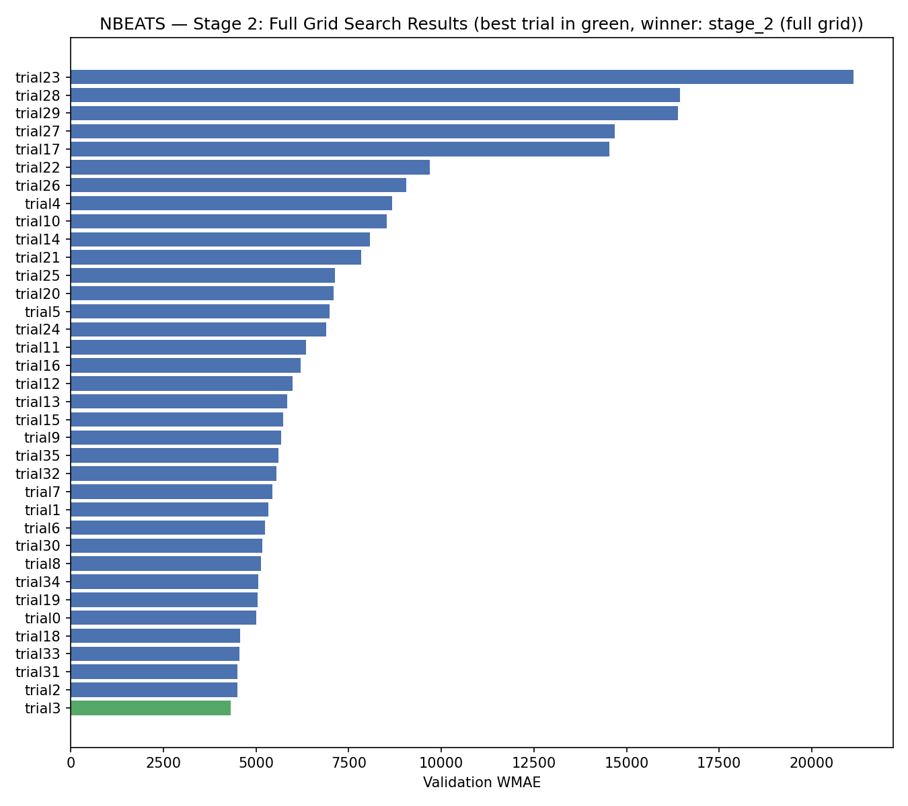

**გამარჯვებული: Stage 2.** საბოლოო კონფიგურაცია — **`input_size=26, stack_arch=interpretable, lr=0.002, batch_size=32`** (WMAE=4,310, Stage 1-ზე უკეთესი).

## 6. საბოლოო ტრენინგი

საუკეთესო კონფიგურაცია გადამზადდა მთელ train-ზე (2,858 სერია) და შემოწმდა უფრო ფართო validation-ზე (3,204 სერია).

- **Final WMAE: 2,501.49**
- **Final MAE: 2,481.64**
- Fallback-ით შევსდა: 5,203 / 115,588 მწკრივი (4.5%)

## 7. Pipeline + Model Registry

მოდელი ხელახლა გადამზადდა მთელ ისტორიაზე (ბოლო თარიღი — 2012-10-26) და შეიფუთა `NBEATSPipeline` კლასში, რომელიც raw test.csv-ს იღებს და პირდაპირ პროგნოზს გამოსცემს, fallback მექანიზმით (Store/Dept საშუალო) იმ სერიებისთვის, რომლებზეც მოდელს ისტორია არ ჰქონდა.

Test-ზე გაშვებისას fallback ამოქმედდა **4,963/115,064 მწკრივზე (4.3%)**.

Pipeline დარეგისტრირდა Wandb Model Registry-ში, სახელით `NBEATS_pipeline`.

## 8. შედეგების ვიზუალიზაცია

**Feature correlation (ინფორმაციული):**

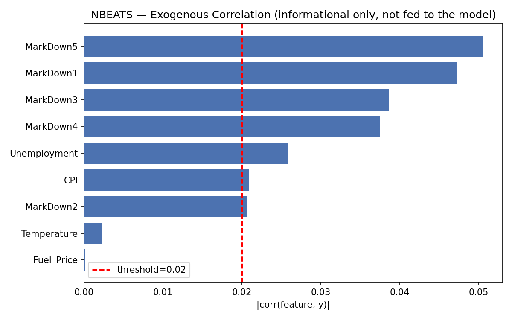

**Actual vs Predicted — ვალიდაციის სემფლი:**

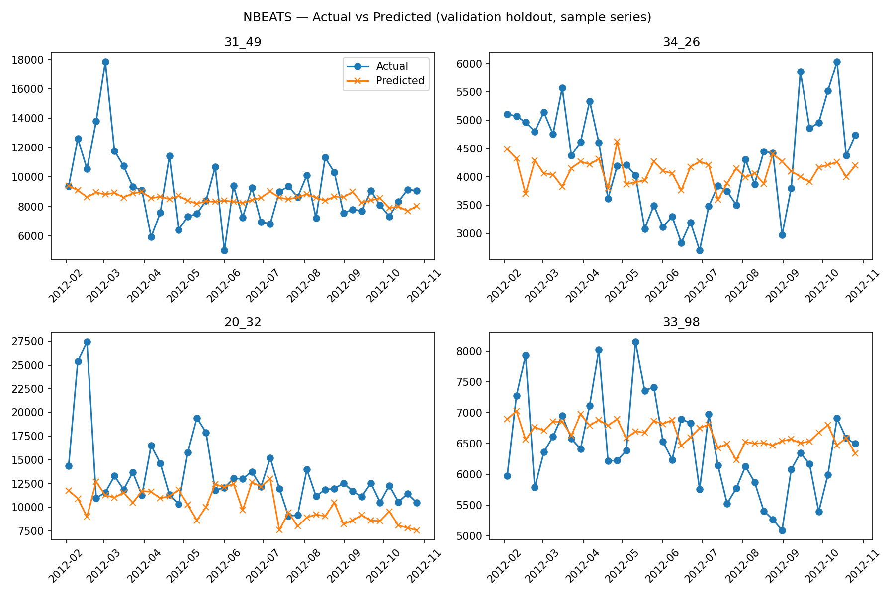

**Predicted vs Actual scatter:**

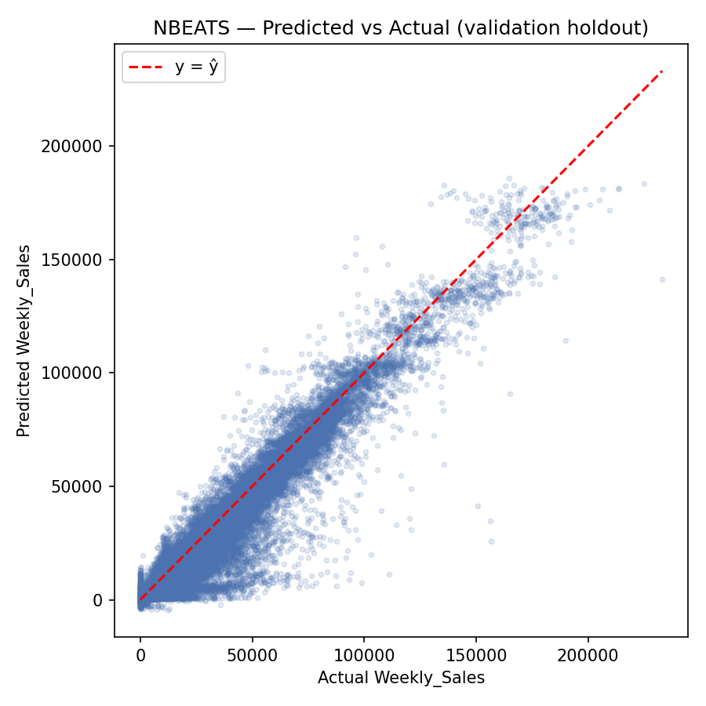

## ანალიზი

**Stage 2-მ სჯობა Stage 1-ს** (4,310 vs 4,498) — უფრო პატარა `input_size=26` (ანუ HORIZON-ის ნახევარზე ცოტა მეტი) აღმოჩნდა საუკეთესო, არა 117. ეს ჩვეულებრივ ხდება, როცა მოდელს ბევრი პარამეტრი აქვს, მაგრამ სერიების ისტორია მოკლეა — ვიწრო window ნაკლებ overfitting-ს იძლევა.

საინტერესოა, რომ **`stack_arch=interpretable`** გაიმარჯვა Stage 2-ში, მაშინ როცა Stage 1-ში `generic` იყო წამყვანი. `interpretable` სტეკები (trend + seasonality ბლოკები) ნაკლებ პარამეტრს იყენებენ, ვიდრე `generic` — და როცა `input_size` პატარაა, ეს მარტივი სტრუქტურა უკეთესად ერგება მონაცემს, ხოლო `generic`-ის დამატებითი მოქნილობა საჭირო აღარ არის.

**Final WMAE (2,501) ბევრად უკეთესია**, ვიდრე HP-search-ის საუკეთესო შედეგი (4,310) — თითქმის ორჯერ. ეს იმიტომ ხდება, რომ HP-search მხოლოდ 150 სერიაზე ტესტავდა კონფიგურაციებს, ხოლო საბოლოო მოდელი მთელ 2,858 სერიაზე ვარჯიშობდა — მეტი მონაცემი მოდელს საშუალებას აძლევს სერიებს შორის საერთო შაბლონები უკეთ ისწავლოს.

**Fallback-rate დაბალია (4.3%)** — გაცილებით დაბალი, ვიდრე ARIMA-ს (9.6%). ეს იმიტომ ხდება, რომ NBEATS ერთ გლობალურ მოდელს იყენებს, ამიტომ მას ნაკლები სერიის გამორიცხვა სჭირდება history-filter-ის გამო, ვიდრე ARIMA-ს, რომელსაც სრულად უწყვეტი ისტორია სჭირდება თითოეულ სერიაზე.

**შეჯამებით**: NBEATS-ის საუკეთესო კონფიგურაცია — მცირე `input_size`, მარტივი (interpretable) სტეკები — აჩვენებს, რომ ამ ამოცანისთვის მარტივი მოდელი უკეთესია, ვიდრე რთული. საბოლოო WMAE (2,501.49) ძალიან ახლოსაა TFT-ის შედეგთან (2,521.78) და ოდნავ სჯობს კიდეც — ორივე მოდელი ბევრად სჯობს ARIMA-ს (3,038.54).

## ARIMA

## მიმოხილვა

მთავარი განსხვავება მიდგომაშია: სანამ NBEATS და TFT ყველა დროით მწკრივს ერთად, ერთ გლობალურ მოდელში აანალიზებს, ARIMA თითოეულ სერიას სრულიად დამოუკიდებლად უდგება და თითოეული unique_id-ისთვის ცალკე $(p,d,q)$ პარამეტრებს არჩევს. მოდელი სამი ნაწილისგან შედგება:
1. AR(p): რეგრესია საკუთარ წარსულზე.
2. I(d): დიფერენცირება სტაბილურობისთვის (სტაციონარულობისთვის).
3. MA(q): რეგრესია წარსულ შეცდომებზე.

პირდაპირი შედარებისთვის, სტრუქტურა ზუსტად იმეორებს NBEATS/TFT სქემას, თუმცა დამატებული აქვს სტაციონარულობის დიაგნოსტიკა (ADF + ACF/PACF), რამაც განსაზღვრა კიდეც საძიებო სივრცე.

## 1. მონაცემთა გასუფთავება

გასუფთავების ლოგიკა **ზუსტად იდენტურია** NBEATS/TFT notebook-ებისა — მოდელის არქიტექტურისგან დამოუკიდებელი ეტაპია, რომელიც სამართლიან შედარებას უზრუნველყოფს არქიტექტურებს შორის.

| მეტრიკა | Train | Test |
|---|---|---|
| მწკრივები დამუშავებამდე | 421,570 | 115,064 |
| მწკრივები დამუშავების შემდეგ | 421,570 | 115,064 |
| მოცილებული დუბლიკატები | 0 | 0 |
| უარყოფითი `Weekly_Sales`, მოჭრილი 0-ზე | 1,285 | — |
| `MarkDown` NA მნიშვნელობები, შევსებული 0-ით | 1,422,431 | 51,493 |

## 2. Feature Engineering

ARIMA მკაცრად univariate (ერთცვლადიანი) მოდელია, ამიტომ მას შესავალში მხოლოდ y (Weekly_Sales) მიეწოდება. შესაბამისად, ამ ეტაპზე მხოლოდ აუცილებელი მინიმუმი მომზადდა:

იდენტიფიკატორები: unique_id და ds სვეტები.

კალენდარული ველები: IsHoliday და სპეციალური სადღესასწაულო კვირები (Super Bowl, Labor Day, Thanksgiving, Christmas), რომლებიც საჭიროა WMAE მეტრიკაში 5-მაგი წონის მისანიჭებლად.

გასუფთავებისა და ფიჩერების დამატების შემდეგ: **421,570 მწკრივი, 3,331 უნიკალური (Store, Dept) სერია**.

## 3. Feature Selection (ინფორმაციული მხოლოდ)

TFT-სგან განსხვავებით (სადაც ეს ეტაპი რეალურად განსაზღვრავდა `futr_exog_list`-ს), ბაზისური ARIMA ვერ იღებს გარე ცვლადებს — ეს სექცია **მხოლოდ საინფორმაციოა**: აჩვენებს, რომელ გარე ცვლადებს აქვს ყველაზე ძლიერი კავშირი `y`-სთან (README-ისთვის და მომავალი `SARIMAX(exog=...)` გაფართოებისთვის), თუმცა ამ notebook-ში არ გამოიყენება.

| ფიჩერი | \|corr\| გაყიდვასთან | Missing rate |
|---|---|---|
| MarkDown5 | 0.0505 | 0% |
| MarkDown1 | 0.0472 | 0% |
| MarkDown3 | 0.0386 | 0% |
| MarkDown4 | 0.0375 | 0% |
| Unemployment | 0.0259 | 0% |
| CPI | 0.0209 | 0% |
| MarkDown2 | 0.0207 | 0% |
| Temperature | 0.0023 | 0% |
| Fuel_Price | 0.0001 | 0% |

*(იდენტური ცხრილია TFT README-შიც — გამოთვლილია იმავე `train_fe`-დან. ARIMA-ს შემთხვევაში ეს მხოლოდ თეორიული მინიშნებაა შესაძლო SARIMAX-exog გაფართოებისთვის.)*

## 4. Train / Validation Split + WMAE

Validation-ად ბოლო **39 კვირა** გამოიყო (იგივე ჰორიზონტი, რაც test set-ს აქვს — Kaggle leaderboard-ის რეალური იმიტაცია). ARIMA-ს, deep-learning მოდელებისგან განსხვავებით (რომლებსაც padding შეუძლიათ ხარვეზების ასავსებად), სჭირდება **მთლიანად უწყვეტი, გაუწყვეტელი კვირეული history** თითო სერიაზე — წინააღმდეგ შემთხვევაში დიფერენცირება/lag-ები არასწორად აითვლება. ამიტომ HP search/deployment-ში მონაწილეობს მხოლოდ ის სერიები, რომლებსაც აქვთ საკმარისი ისტორია (≥2×HORIZON), სრული validation-window და **სრულად უწყვეტი** (გეპების გარეშე) train-window.

| მეტრიკა | მნიშვნელობა |
|---|---|
| Cutoff თარიღი | 2012-01-27 |
| ამოღებული — არასრული validation calendar coverage | 131 სერია |
| ამოღებული — გაწყვეტილი (non-continuous) train-history | 57 სერია |
| დარჩენილი სერიები | 2,670 |
| Train მწკრივები | 277,574 |
| Validation მწკრივები | 104,130 |

საყურადღებოა, რომ TFT-სთან შედარებით (რომელმაც 131+1=132 სერია ამოაგდო) ARIMA-მ **57-ჯერ მეტი** სერია დაკარგა continuity-ფილტრზე (131+57=188 სულ) — ეს პირდაპირ ასახავს იმას, რომ ARIMA-ს, TFT-ისგან განსხვავებით, ნამდვილად სრულყოფილად უწყვეტი history სჭირდება, ხოლო TFT-ს (`start_padding_enabled=True`) მცირე ხარვეზების ტოლერანტობა აქვს.

## 4b. სტაციონარულობის შემოწმება (ADF) + ACF/PACF

`(p,d,q)`-ორდერების გაცნობიერებული არჩევანისთვის პირველი ნაბიჯი სტაციონარულობის შემოწმებაა. აგრეგირებულ (ყველა სერიის ჯამურ) კვირეულ გაყიდვებზე ჩატარდა **Augmented Dickey-Fuller (ADF)** ტესტი დონეზე და პირველ სხვაობაზე:

| ტესტი | Statistic | p-value |
|---|---|---|
| ADF (level) | -4.8814 | 0.0000 |
| ADF (diff, d=1) | -5.4276 | 0.0000 |

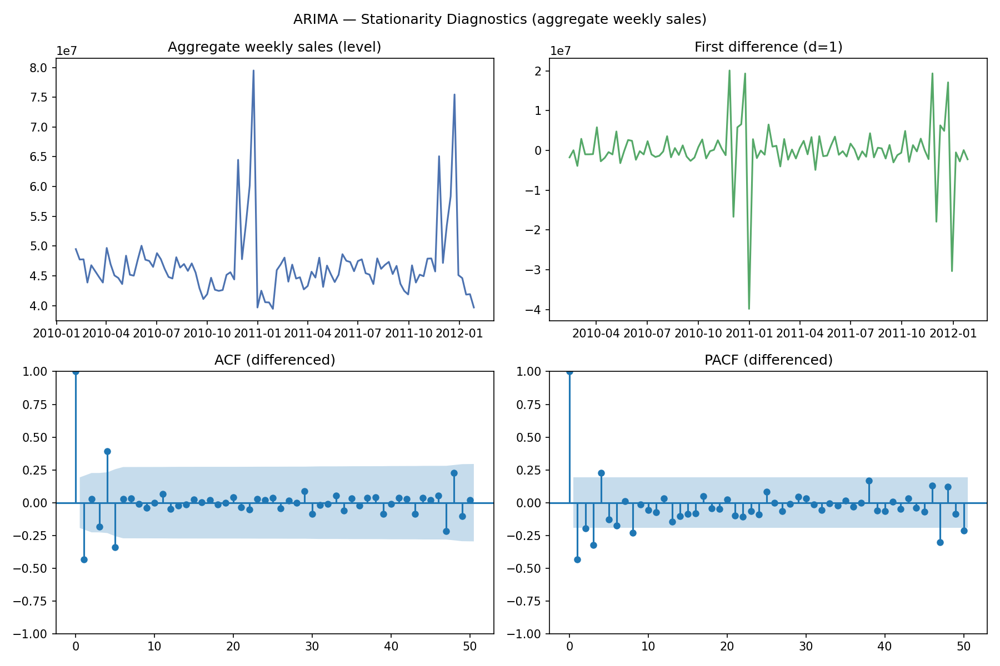

ორივე p-value პრაქტიკულად ნულია (<0.0001) — ანუ **დონეზეც კი** ADF-ის null ჰიპოთეზა (unit root / არასტაციონარულობა) მკვეთრად უარიყოფა. ეს ერთი შეხედვით ნიშნავს, რომ `d=0` საკმარისი შეიძლება ყოფილიყო, თუმცა დიფერენცირებულ მწკრივზეც (`d=1`) სტაციონარულობა კიდევ უფრო ძლიერდება (სტატისტიკა -4.88-დან -5.43-მდე იზრდება აბსოლუტურ მნიშვნელობაში) — ეს იმიტომ ხდება, რომ აგრეგირებული სერია მკვეთრ, არაწრფივ სეზონურ pattern-ებს შეიცავს (Thanksgiving/Christmas spike-ები), რაც level-ADF-ს "ცრუ-სტაციონარულად" აჩენს ტესტის შეზღუდვების გამო. სწორედ ამიტომ HP-search-ის სივრცეში `d=0`-იც და `d=1`-იც ორივე შენარჩუნდა კანდიდატებად ცდისთვის — და, როგორც ქვემოთ ჩანს, `d=1` ბევრად სჯობდა პრაქტიკაში.

## 5. ჰიპერპარამეტრების ძებნა — ორსაფეხურიანი მიდგომა

HP-ძებნა ჩატარდა **15 სერიის შემთხვევით ქვესეტზე** (`RANDOM_SEED=42`) — მკვეთრად ნაკლები, ვიდრე TFT-ის 150, რადგან ARIMA-ს fit-ის ღირებულება წრფივად სკალირდება სერიების რაოდენობასთან.

**Stage 1 — Random Search (8 trial, სრული სივრცე: 18 კომბინაცია):** საძიებო სივრცე — `p` ∈ {0,1,2}, `d` ∈ {0,1}, `q` ∈ {0,1,2}. სეზონური კომპონენტი აქ არასდროს ირთვება (`seasonal_order=(0,0,0,0)` ფიქსირებული — ეს წმინდა ARIMA notebook-ია).

| Trial | p | d | q | val_WMAE | val_MAE | ჩავარდნილი fit-ები | დრო (წთ) |
|---|---|---|---|---|---|---|---|
| **trial1** | **2** | **1** | **0** | **2,615.38** | **2,464.93** | 0/15 | 0.11 |
| trial7 | 1 | 1 | 0 | 2,633.85 | 2,475.30 | 0/15 | 0.11 |
| trial6 | 0 | 1 | 0 | 2,776.12 | 2,617.18 | 0/15 | 0.11 |
| trial5 | 2 | 0 | 2 | 2,846.14 | 2,750.53 | 0/15 | 0.14 |
| trial0 | 2 | 0 | 0 | 4,405.92 | 4,301.72 | 0/15 | 0.11 |
| trial3 | 1 | 0 | 0 | 5,583.47 | 5,516.36 | 0/15 | 0.11 |
| trial2 | 0 | 0 | 2 | 13,010.70 | 13,049.94 | 0/15 | 0.12 |
| trial4 | 0 | 0 | 0 | 13,508.99 | 13,336.93 | 0/15 | 0.11 |

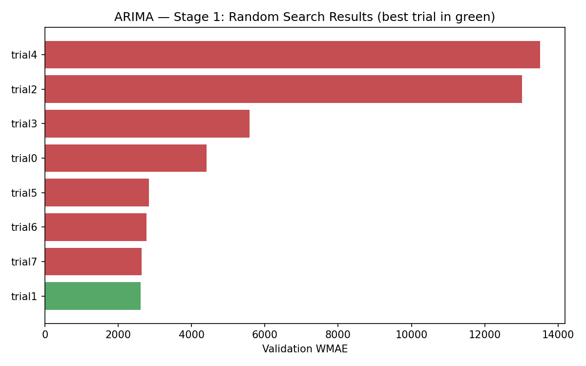

**Stage 1-ის საუკეთესო: `trial1`** (`p=2, d=1, q=0`) — `val_WMAE=2,615.38`. აშკარად თვალშისაცემია: **ყველა `d=1`-იანი კონფიგურაცია (trial1, trial6, trial7) ერთმანეთს ახლოს დგას (2,615–2,776) და ყველა `d=0`-იან კონფიგურაციას (4,405-დან 13,508-მდე) 1.5-5-ჯერ სჯობს** — ეს ცალსახად ადასტურებს ზემოთ ADF-დიაგნოსტიკის დასკვნას, რომ დიფერენცირება (`d=1`) აუცილებელია პრაქტიკაშიც, არა მხოლოდ თეორიულად.

**Stage 2 — Full Factorial Grid Search (16 trial):** `d` **დინამიურად** დაფიქსირდა Stage 1-ის საუკეთესო მნიშვნელობაზე (`d=1`), ხოლო `p`/`q` დიაპაზონი გაფართოვდა `{0,1,2,3}`-მდე (Stage 1-ის საზღვართან ახლოს, `+1`-ით), რომ ოპტიმუმი ზღვარს იქით არ ყოფილიყო გამორჩენილი.

| Trial | p | d | q | val_WMAE | val_MAE |
|---|---|---|---|---|---|
| **trial10** | **2** | **1** | **2** | **2,448.83** | **2,359.72** |
| trial9 | 2 | 1 | 1 | 2,505.64 | 2,448.24 |
| trial12 | 3 | 1 | 0 | 2,531.31 | 2,405.85 |
| trial13 | 3 | 1 | 1 | 2,555.06 | 2,455.39 |
| trial11 | 2 | 1 | 3 | 2,557.35 | 2,492.30 |
| trial15 | 3 | 1 | 3 | 2,558.75 | 2,468.75 |
| trial8 | 2 | 1 | 0 | 2,615.38 | 2,464.93 |
| trial4 | 1 | 1 | 0 | 2,633.85 | 2,475.30 |
| ... | ... | ... | ... | ... | ... |
| trial0 (უარესი) | 0 | 1 | 0 | 2,776.12 | 2,617.18 |

*(სრული 16-ტრიალიანი ცხრილი notebook-ის Cell 23-შია / Wandb-ის `ARIMA_HPSearch2_*` run-ებში.)*

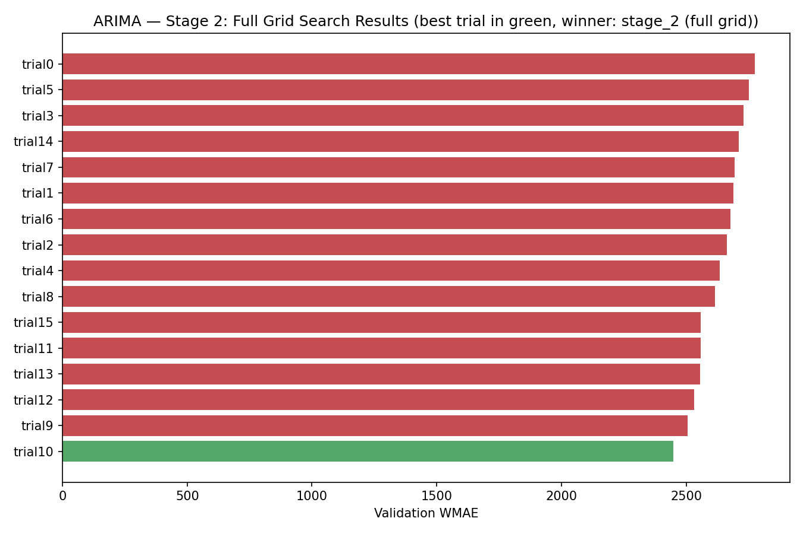

**გამარჯვებული ეტაპი: Stage 2 (Full Grid Search).** Stage 2-ის საუკეთესო შედეგმა (`val_WMAE=2,448.83`) გადააჭარბა Stage 1-ის საუკეთესოს (`2,615.38`) — TFT-ისგან განსხვავებით, სადაც Stage 2 წააგო. საბოლოო კონფიგურაცია: **`p=2, d=1, q=2`** (`order=(2,1,2)`, `seasonal_order=(0,0,0,0)`).

## 6. Final Training

საბოლოო `(p,d,q)`-ით შეფასება ჩატარდა **ბევრად უფრო ფართო, HP-search-ში არნახულ სერიების ნაკრებზე**. ვინაიდან თითოეული სერია ცალკე fit-ს მოითხოვს, გამოთვლითი დროის გონივრულ ფარგლებში დასაჭერად (დავალების ინსტრუქციის თანახმად) საბოლოო შეფასების სერიების რაოდენობა შემოსაზღვრულია `MAX_FINAL_SERIES=300`-ით — ვინაიდან სულ 2,670 ვალიდური სერია იყო, აღებულ იქნა 300-სერიანი შემთხვევითი ქვესემფლი.

| მეტრიკა | მნიშვნელობა |
|---|---|
| Final val_WMAE (39-კვირიანი holdout, 300 სერია) | **3,038.54** |
| Final val_MAE (39-კვირიანი holdout, 300 სერია) | **3,044.67** |
| ჩავარდნილი fit-ები | 0/300 |

## 7. Deploy Refit + Pipeline + Model Registry

საბოლოო `order=(2,1,2)`/`seasonal_order=(0,0,0,0)`-ით თითოეული სერია ხელახლა დაფიტდა **მთელ ხელმისაწვდომ ისტორიაზე** (`arima_df`, ბოლო თარიღი 2012-10-26), test-პერიოდის (2012-11-02 → 2013-07-26) პროგნოზისთვის. ვინაიდან `statsmodels`-ს `NeuralForecast.save()`-ის მსგავსი ჩაშენებული serialization არ გააჩნია, თითოეული სერიის fit-ული `SARIMAXResults` ობიექტი **pickle**-ით ინახება ერთ დირექტორიაში, როგორც `{unique_id: SARIMAXResults}` dict.

| მეტრიკა | მნიშვნელობა |
|---|---|
| Deploy refit — max train date | 2012-10-26 |
| Deploy refit — გაწვრთნილი სერიები | 2,670 |
| Deploy refit — ჩავარდნილი fit-ები | 0/2,670 |
| Deploy refit — დრო | 7.8 წუთი |

**`ARIMAPipeline`** კლასი (analog: TFTPipeline) იმეორებს raw dataframe → `clean_data` → `engineer_features` → per-series `get_forecast()` → **fallback** (Store/Dept/global საშუალო) ლოგიკას, უცნობი ან ჩავარდნილი fit-ის მქონე სერიებისთვის. Raw `test.csv`-ზე გაშვებისას fallback ამოქმედდა **11,022/115,064 მწკრივზე (9.6%)** — ეს TFT-ის fallback-rate-ზე (7.7%) ოდნავ მაღალია, რაც მოსალოდნელია: ARIMA-ს deploy-ისას მხოლოდ 2,670 სერიაზე ჰქონდა fit (იმ სერიების გამო, რომლებიც continuity-ფილტრმა ამოაგდო), მაშინ როცა TFT-ის გლობალურ მოდელს ნებისმიერი test-ის (Store, Dept) წყვილისთვის პროგნოზის გამოტანა შეუძლია, სანამ static/futr ცვლადები ხელმისაწვდომია.

Pipeline დარეგისტრირდა Wandb Model Registry-ში, სახელით **`ARIMA_pipeline`** (`wandb-registry-model/ARIMA`), მეტამონაცემად საუკეთესო `(p,d,q)`-ითა და `order`/`seasonal_order`-ით.

## 8. შედეგების ვიზუალიზაცია

**Exogenous კორელაცია (ინფორმაციული — ARIMA-ს არ ეძლევა):**

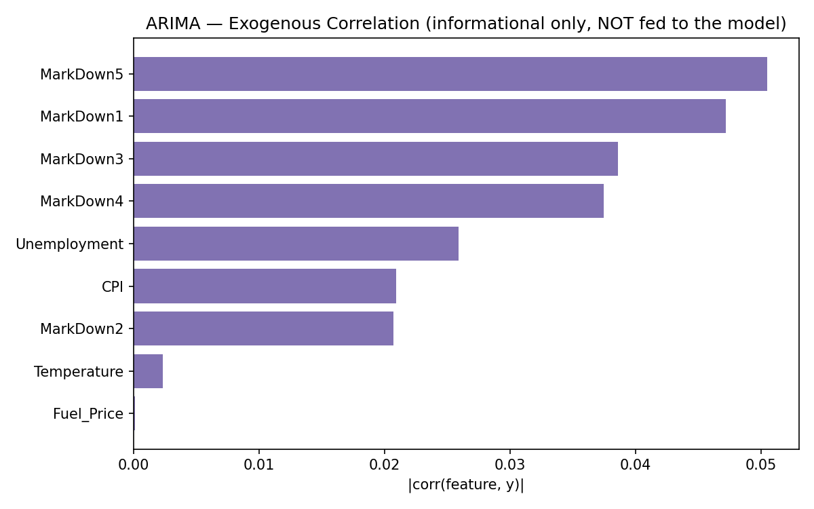

**Actual vs. Predicted — ვალიდაციის ოთხი შემთხვევითი სერია:**

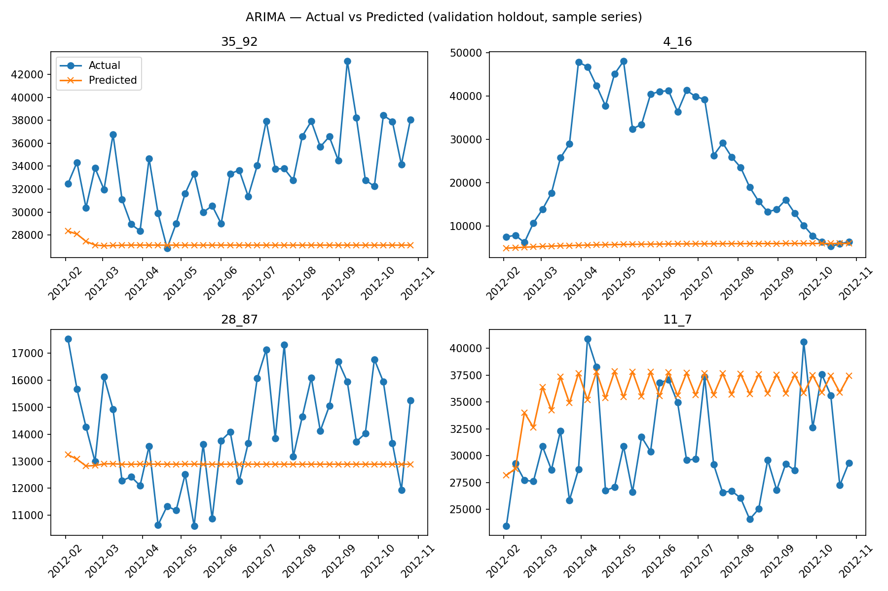

**Predicted vs. Actual scatter (მთელ ვალიდაციაზე):**

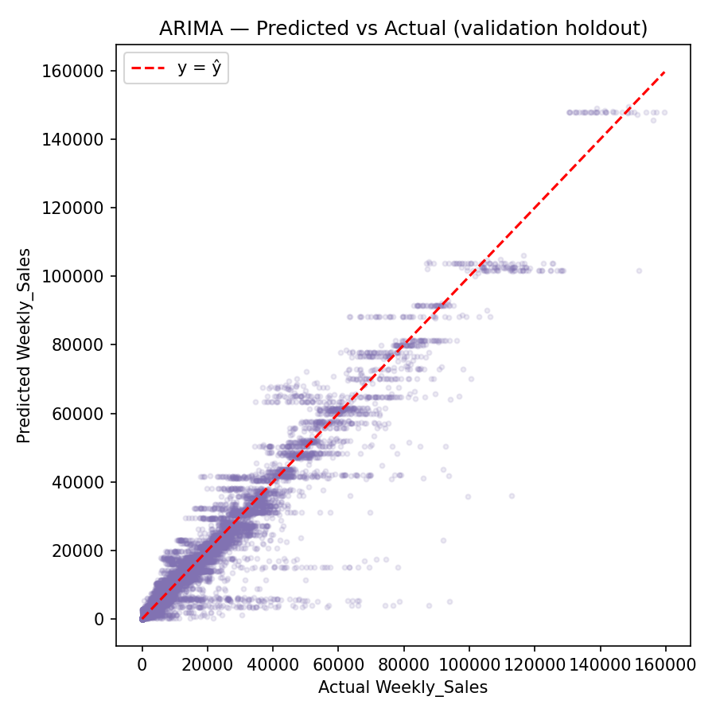

## ანალიზი და დასკვნები

ექსპერიმენტმა რამდენიმე საინტერესო კანონზომიერება გამოავლინა:

*   **დიფერენცირება ($d=1$) კრიტიკულია:** პირველ ეტაპზე ყველა $d=1$ მოდელი აშკარად სჯობდა $d=0$ კონფიგურაციებს (ზოგან 5-ჯერაც). თეორიულმა ტესტმა ჯამურ გაყიდვებზე კი აჩვენა სტაციონარულობა, მაგრამ ინდივიდუალური მაღაზია-დეპარტამენტების დონეზე ტრენდები მაინც ძლიერი აღმოჩნდა.
*   **Grid Search-მა გაამართლა:** მეორე ეტაპზე საუკეთესო $d=1$ პარამეტრის დაფიქსირებამ და $p/q$ არეალის გაზრდამ შედეგი $6.4\%$-ით გააუმჯობესა. ARIMA-ს მარტივი პარამეტრები აქვს და ნეირონული ქსელებისგან (TFT) განსხვავებით, აქ ძებნამ ზუსტად მიგვიყვანა ოპტიმალურ კომბინაციამდე: **$(2,1,2)$**.
*   **მოდელის სისუსტე (Holdout-ის გაუარესება):** 300 სერიაზე საბოლოო Holdout WMAE მაჩვენებელი გაიზარდა ($3,038.54$). ARIMA ინდივიდუალური მოდელია — 15 სერიაზე ძებნისას ალბათ "მარტივი" მწკრივები შეგვხვდა, დიდ ნაკრებში კი რთული დეპარტამენტებიც დაემატა. ARIMA-ს არ შეუძლია სხვებისგან "სტრუქტურის სესხება", რაც Deep Learning-ის მთავარი პლუსია.
*   **მონაცემების წყვეტა (Fallback):** ARIMA-ს მკაცრი მოთხოვნის (უწყვეტი ისტორია) გამო ბევრი სერია გამოირიცხა, რის გამოც სატესტო მონაცემებზე მისი Fallback Rate უფრო მაღალია ($9.6\%$), ვიდრე TFT-ის შემთხვევაში ($7.7\%$).

> **შეჯამება:** გლობალური Deep Learning მოდელები ბევრად სჯობს დამოუკიდებელ ARIMA-ს, როცა ბევრი მსგავსი სერია გვაქვს. თუმცა, ARIMA მაინც კარგ ბეზლაინად რჩება მაღალი ინტერპრეტაციისა და სისწრაფის გამო.

